# AI Dev Team 🤖

**Your own AI software development team in a single CLI tool**

A multi-agent AI system powered by Groq that acts as a complete full-stack development team. Give it natural language requirements, and watch as 9 specialized AI agents collaborate to build your project from scratch.

[](https://opensource.org/licenses/MIT)
[](https://www.python.org/downloads/)

---

## 🌟 Features

### 9 Specialized AI Agents

```mermaid
graph LR
    A[User Requirements] --> B[Orchestrator]
    B --> C[Product Manager]
    C --> D[Software Architect]
    D --> E[Frontend Engineer]
    D --> F[Backend Engineer]
    D --> G[Database Engineer]
    E --> H[Code Reviewer]
    F --> H
    G --> H
    H --> I[QA Engineer]
    I --> J[Evaluator]
    J --> K[Complete Project ✅]

    style A fill:#e1f5ff
    style B fill:#fff4e6
    style J fill:#e7f5e7
    style K fill:#d4edda
```



- **🎯 Orchestrator** - Analyzes requirements, detects complexity, creates execution plan
- **👔 Product Manager** - Clarifies vague requirements, creates specifications
- **🏗️ Software Architect** - Designs system architecture and patterns
- **💻 Frontend Engineer** - Builds UI with React, Vue, or vanilla JS
- **⚙️ Backend Engineer** - Creates APIs and server-side logic
- **🗄️ Database Engineer** - Designs schemas, migrations, and queries
- **🔍 Code Reviewer** - Reviews quality with automatic code analysis
- **🧪 QA Engineer** - Tests functionality and finds edge cases
- **✅ Evaluator** - Final validation and approval

### Advanced Capabilities

- **🔄 Reflection System** - Automatic code quality evaluation (syntax, complexity, security)
- **🖥️ Terminal Integration** - Full file system and command execution with safety checks
- **🖼️ Vision Support** - Can analyze images, screenshots, and design mockups
- **🤝 Human-in-the-Loop** - Requests approval for critical actions with risk assessment
- **💰 Cost Tracking** - Real-time monitoring (typically $0.001-0.05 per task)
- **⚡ Smart Optimization** - Detects simple tasks and uses fast-path execution
- **📍 Path-Aware** - Agents know their working directory and output location

---

## 🚀 Quick Start

### 1. Installation

```bash
# Clone or navigate to the repository
cd /path/to/coding-agent

# Create and activate virtual environment
python -m venv .venv
source .venv/bin/activate  # Windows: .venv\Scripts\activate

# Install dependencies
pip install -r requirements.txt
```

### 2. Configuration

```bash
# Create .env file with your Groq API key
echo "GROQ_API_KEY=your_api_key_here" > .env

# Get a free API key at: https://console.groq.com/keys
```

### 3. Run Your First Project

```bash
# Simple test
python -m ai_dev_team "Create a Python hello world script"

# Full-stack application
python -m ai_dev_team "Build a todo app with React and Flask"

# Interactive mode for multiple requests
python -m ai_dev_team --interactive
```

### 4. (Optional) Install Global Command

```bash
# Add to ~/.zshrc or ~/.bashrc
echo 'alias aidev="source /path/to/coding-agent/.venv/bin/activate && python -m ai_dev_team"' >> ~/.zshrc
source ~/.zshrc

# Now use from anywhere
cd ~/Projects/my-app
aidev "Add authentication" --output ./src --auto-approve
```

---

## 📖 Usage

### Basic Command

```bash
python -m ai_dev_team "YOUR REQUIREMENTS" [OPTIONS]
```

### Options

| Option | Description | Example |
|--------|-------------|---------|
| `-i, --interactive` | Multi-turn conversation mode | `--interactive` |
| `--image PATH` | Analyze an image/design mockup | `--image design.png` |
| `--auto-approve` | Skip approval prompts (autonomous) | `--auto-approve` |
| `--output DIR` | Output directory (default: workspace/) | `--output ./src` |
| `--max-iterations N` | Maximum iterations per agent | `--max-iterations 100` |
| `-v, --verbose` | Show detailed logs | `--verbose` |
| `--help` | Show help message | `--help` |

### Example Use Cases

#### Full-Stack Web App

```bash
python -m ai_dev_team "Create a blog platform with:
- React frontend with Tailwind CSS
- Node.js/Express backend
- PostgreSQL database
- User authentication with JWT
- CRUD operations for blog posts
- Responsive design
- Comment system"
```

#### REST API

```bash
python -m ai_dev_team "Build a bookstore API with:
- FastAPI framework
- SQLite database
- Endpoints for books, authors, customers
- JWT authentication
- Input validation
- OpenAPI documentation"
```

#### From Design Mockup

```bash
python -m ai_dev_team "Recreate this landing page" --image mockup.png --output ./src
```

#### Interactive Development

```bash
python -m ai_dev_team --interactive

# Then type your requests:
> "Create a user authentication system"
> "Add password reset functionality"
> "Create email templates"
> "Add unit tests for auth module"
> quit
```

---

## 🏗️ Architecture

### System Overview


### Agent Decision Flow

```mermaid
flowchart TD
    START[User Requirements] --> ORCH[Orchestrator Analyzes]
    ORCH --> CHECK{Complexity?}

    CHECK -->|SIMPLE<br/>15 words or patterns| FAST[Fast Path]
    CHECK -->|MEDIUM/COMPLEX| LLM[LLM Analysis]

    FAST --> IMPL1[1 Agent: Backend/Frontend Engineer]
    IMPL1 --> DONE1[Complete ✅]

    LLM --> MEDIUM{Medium or Complex?}

    MEDIUM -->|MEDIUM<br/>Multiple files| IMPL2[Implementation Agents]
    IMPL2 --> EVAL2[Evaluator Only]
    EVAL2 --> DONE2[Complete ✅]

    MEDIUM -->|COMPLEX<br/>Full application| ALL[All Agents]
    ALL --> PM2[Product Manager]
    PM2 --> ARCH2[Architect]
    ARCH2 --> ENG[Engineers: FE, BE, DB]
    ENG --> CR2[Code Reviewer]
    CR2 --> QA2[QA Engineer]
    QA2 --> EVAL3[Evaluator]
    EVAL3 --> DONE3[Complete ✅]

    style START fill:#e1f5ff
    style FAST fill:#d4edda
    style DONE1 fill:#d4edda
    style DONE2 fill:#d4edda
    style DONE3 fill:#d4edda
```



### How Agents Communicate

Agents share a **context object** that flows through the pipeline:

```python
context = {
    "requirements": "Original user requirements",
    "refined_requirements": "Detailed specifications from Product Manager",
    "architecture": "System design from Architect",
    "files_created": ["file1.py", "file2.js"],
    "code_review_feedback": "Issues found by Code Reviewer",
    "test_results": "QA test outcomes",
    "output_dir": "/absolute/path/to/output",
    "current_working_dir": "/user/original/directory",
    "complexity": "simple | medium | complex"
}
```

Each agent:
1. Receives context from previous agents
2. Executes its specialized task
3. Updates context with its results
4. Passes context to next agent

---

## 🔧 How It Works

### Step-by-Step Execution

1. **Requirements Analysis**
   - Orchestrator analyzes your requirements
   - Detects complexity level (simple/medium/complex)
   - Creates execution plan with appropriate agents

2. **Planning Phase** (Complex projects only)
   - Product Manager refines requirements
   - Architect designs system architecture
   - Tech stack and patterns determined

3. **Implementation Phase**
   - Frontend, Backend, Database engineers build code
   - Each agent iteratively calls LLM and executes tools
   - Files are created in output directory
   - All paths are tracked and validated

4. **Quality Assurance**
   - Code Reviewer analyzes all files
   - Checks syntax, complexity, security, best practices
   - QA Engineer writes and runs tests
   - Issues flagged for human approval

5. **Final Validation**
   - Evaluator confirms all requirements met
   - Validates file structure
   - Generates project summary
   - Cost tracking displayed

### Tool Execution Flow


---

## 💰 Cost Estimation

AI Dev Team uses Groq's ultra-fast and affordable LLM inference.

### Typical Costs

| Project Type | Time | Cost | Tokens | Agents Used |
|--------------|------|------|--------|-------------|
| Simple script ("Hello World") | 2-10s | $0.0008-0.001 | 1,000-2,000 | 1 |
| CRUD app (basic) | 30-60s | $0.01-0.02 | 10,000-20,000 | 2-3 |
| REST API (full) | 1-2min | $0.02-0.05 | 20,000-50,000 | 4-6 |
| Full-stack app | 2-5min | $0.05-0.15 | 50,000-150,000 | 7-9 |
| Complex system | 5-15min | $0.15-0.50 | 150,000-500,000 | 9 |

**Why so cheap?**
- Groq's inference is 10-100x faster than alternatives
- Smart complexity detection skips unnecessary agents
- Optimized token limits (512 for simple, 2048 for complex)
- Pattern matching for instant simple task detection

### Cost Tracking

Every run shows real-time cost tracking:

```
💰 Cost Summary:
┌──────────────────┬──────────┐
│ Total Cost       │ $0.0234  │
│ Input Tokens     │ 12,450   │
│ Output Tokens    │ 8,320    │
│ Model            │ llama-3.3-70b │
└──────────────────┴──────────┘
```

---

## ⚙️ Configuration

### Environment Variables (.env)

```bash
# Required
GROQ_API_KEY=your_api_key_here

# Optional (with defaults)
GROQ_MODEL=llama-3.3-70b-versatile  # Change model
AUTO_APPROVE=false                   # Skip approvals
VERBOSE=false                        # Detailed logs
MAX_ITERATIONS=50                    # Per-agent limit
```

### Model Options

| Model | Speed | Cost (per 1M tokens) | Best For |
|-------|-------|---------------------|----------|
| **llama-3.3-70b-versatile** | Fast | $0.59 input / $0.79 output | Balanced (default) |
| **mixtral-8x7b-32768** | Fastest | $0.24 / $0.24 | Cost savings |
| **llama-3.2-90b-vision-preview** | Medium | $0.90 / $1.15 | Image analysis |

### Customization

**Change output directory:**
```bash
python -m ai_dev_team "..." --output ./my-project
```

**Skip approvals for autonomous mode:**
```bash
python -m ai_dev_team "..." --auto-approve
```

**Limit agent iterations for budget control:**
```bash
python -m ai_dev_team "..." --max-iterations 20
```

**Use cheaper/faster model:**
```bash
# Edit .env
GROQ_MODEL=mixtral-8x7b-32768
```

---

## 📁 Project Structure

```
coding-agent/
├── ai_dev_team/              # Main Python package
│   ├── agents/               # 9 specialized agents
│   │   ├── base.py           # BaseAgent class with tool execution
│   │   ├── orchestrator.py   # Task analyzer & planner
│   │   ├── product_manager.py
│   │   ├── architect.py
│   │   ├── frontend_engineer.py
│   │   ├── backend_engineer.py
│   │   ├── database_engineer.py
│   │   ├── code_reviewer.py
│   │   ├── qa_engineer.py
│   │   └── evaluator.py
│   │
│   ├── tools/                # Agent tools
│   │   ├── file_ops.py       # Read, write, list, search files
│   │   ├── terminal.py       # Command execution with safety
│   │   └── vision.py         # Image analysis
│   │
│   ├── reflection/           # Code quality analysis
│   │   └── analyzer.py       # Syntax, complexity, security checks
│   │
│   ├── utils/
│   │   └── human_loop.py     # Approval system & user feedback
│   │
│   ├── config.py             # Configuration management
│   ├── groq_client.py        # Groq API wrapper with cost tracking
│   ├── cli.py                # Main CLI interface
│   └── __main__.py           # Python module entry point
│
├── workspace/                # Default output directory (gitignored)
├── examples/                 # Example usage scripts
├── .env                      # Your API key (gitignored)
├── .env.example              # Example configuration
├── requirements.txt          # Python dependencies
├── README.md                 # This file
├── QUICKSTART.md             # Simple 3-step guide
├── CHANGELOG.md              # All improvements and fixes
└── aidev                     # Global launcher script
```

---

## 🛡️ Security & Safety

### Path Validation

All file operations validate paths to prevent traversal attacks:

```python
def _resolve_path(self, filepath: str) -> Path:
    """Prevent path traversal outside workspace"""
    path = (self.base_dir / filepath).resolve()
    if not str(path).startswith(str(self.base_dir.resolve())):
        raise ValueError(f"Access denied: {filepath} is outside workspace")
    return path
```

### Command Safety

Terminal operations block dangerous commands:

```python
BLOCKED_COMMANDS = [
    'rm -rf /', 'dd if=', 'mkfs', 'format',
    ':(){:|:&};:', 'chmod -R 777 /', ...
]
```

### Risk-Based Approvals

Actions are categorized by risk level:
- **LOW**: Read files, list directories
- **MEDIUM**: Write files, create directories
- **HIGH**: Delete files, execute commands, install packages

High-risk actions require human approval (unless `--auto-approve` set).

---

## 🎯 Best Practices

### Writing Good Requirements

✅ **Good - Specific and detailed:**
```
Build a task management API with:
- FastAPI framework
- PostgreSQL database
- User authentication with JWT
- CRUD endpoints for tasks and projects
- Task assignment to users
- Due dates and priority levels
- Email notifications for deadlines
- OpenAPI documentation
- Unit tests with pytest
```

❌ **Too vague:**
```
Make me an app
```

❌ **Missing key details:**
```
Build a REST API
```

### Using Images Effectively

```bash
# UI mockup → React components
python -m ai_dev_team "Build this exact UI" --image figma-export.png

# Bug screenshot → Fix
python -m ai_dev_team "Fix the layout issue shown here" --image bug-screenshot.png

# Design reference → Implementation
python -m ai_dev_team "Create a dashboard like this" --image inspiration.png
```

### Iterative Development

```bash
# Start with core feature
python -m ai_dev_team "Create a basic todo app with React"

# Add more features iteratively
python -m ai_dev_team "Add user authentication to the todo app" --output ./workspace

python -m ai_dev_team "Add categories and tags to todos" --output ./workspace

python -m ai_dev_team "Add email reminders for due dates" --output ./workspace
```

### Reviewing Generated Code

```bash
# Always review before committing
cd workspace
ls -la
git diff

# Check code quality report
# (automatically generated by CodeReviewer agent)

# Run tests if generated
npm test  # or pytest, etc.
```

---

## 🐛 Troubleshooting

### "Module not found" Error

```bash
# Ensure venv is activated
source .venv/bin/activate

# Reinstall dependencies
pip install -r requirements.txt
```

### "API key not found" Error

```bash
# Verify .env file exists
ls -la .env

# Check key is set
cat .env | grep GROQ_API_KEY

# Or set directly
export GROQ_API_KEY=your_key_here
```

### Permission Errors

```bash
# Make workspace writable
mkdir -p workspace
chmod 755 workspace
```

### Agents Not Following Requirements

- **Be more specific** - Add details about tech stack, features, design
- **Use `--verbose`** - See agent reasoning and tool calls
- **Provide reference images** - Show examples of what you want
- **Break into smaller tasks** - Complex requests benefit from iteration

### High Costs

```bash
# Use cheaper model
echo "GROQ_MODEL=mixtral-8x7b-32768" >> .env

# Limit iterations
python -m ai_dev_team "..." --max-iterations 20

# Be more specific to reduce iterations
# Vague requirements cause agents to iterate more
```

---

## 🚀 Advanced Usage

### Custom Agent Flow

Edit `/ai_dev_team/agents/orchestrator.py` to customize execution plans:

```python
def analyze_requirements(self, requirements: str) -> dict:
    # Add your custom logic here
    if "mobile app" in requirements.lower():
        return self._create_mobile_app_plan()
    # ...
```

### Adding New Agents

1. Create file in `ai_dev_team/agents/your_agent.py`
2. Extend `BaseAgent` class
3. Define system prompt and tools
4. Register in orchestrator

```python
from ai_dev_team.agents.base import BaseAgent

class DevOpsEngineer(BaseAgent):
    def __init__(self, groq_client, tools, human_loop):
        super().__init__(
            name="DevOpsEngineer",
            groq_client=groq_client,
            tools=tools,
            human_loop=human_loop,
            system_prompt="You are a DevOps engineer..."
        )
```

### CI/CD Integration

```yaml
# .github/workflows/ai-generate.yml
name: AI Code Generation

on:
  workflow_dispatch:
    inputs:
      requirements:
        description: 'What to build'
        required: true

jobs:
  generate:
    runs-on: ubuntu-latest
    steps:
      - uses: actions/checkout@v3

      - name: Set up Python
        uses: actions/setup-python@v4
        with:
          python-version: '3.11'

      - name: Install dependencies
        run: |
          python -m venv .venv
          source .venv/bin/activate
          pip install -r requirements.txt

      - name: Generate code
        env:
          GROQ_API_KEY: ${{ secrets.GROQ_API_KEY }}
        run: |
          source .venv/bin/activate
          python -m ai_dev_team "${{ github.event.inputs.requirements }}" \
            --auto-approve \
            --output ./generated

      - name: Create PR
        uses: peter-evans/create-pull-request@v5
        with:
          commit-message: "AI-generated: ${{ github.event.inputs.requirements }}"
          title: "AI Dev Team: ${{ github.event.inputs.requirements }}"
          body: "Automatically generated by AI Dev Team"
          branch: ai-generated-${{ github.run_number }}
```

### Python API

```python
from ai_dev_team.cli import AIDevTeam
from pathlib import Path

# Initialize team
team = AIDevTeam(
    output_dir=Path("./output"),
    auto_approve=True,
    verbose=False
)

# Generate code
result = team.execute_project(
    requirements="Build a Flask API with user authentication",
    image_path=None
)

# Check results
print(f"Cost: ${result['cost']}")
print(f"Files created: {result['files_created']}")
```

---

## 📚 Examples

See the `/examples` directory for complete examples:

- **`simple_script.sh`** - Basic Python script generation
- **`rest_api.sh`** - FastAPI bookstore API
- **`fullstack_app.sh`** - React + Flask todo app
- **`with_image.sh`** - UI from design mockup

---

## 🤝 Contributing

Contributions welcome! This tool is designed to be extended:

- Add new agents for specialized tasks
- Improve reflection techniques
- Enhance tool capabilities
- Add framework-specific templates
- Create pre-built agent workflows

---

## 📄 License

MIT License - Build whatever you want!

---

## 🙏 Credits

- **Groq** - For blazing fast, affordable LLM inference
- **Meta** - Llama 3.3 language model
- **Anthropic** - Inspiration from Claude artifacts
- Built with inspiration from AutoGPT, GPT-Engineer, and DevGPT

---

## 📞 Support

- **Documentation**: Check `QUICKSTART.md` for simple start guide
- **Examples**: See `/examples` directory for patterns
- **Issues**: Open an issue on GitHub
- **API Docs**: Visit https://console.groq.com/docs

---

**Made with ❤️ for developers who want to build faster**

**Cost to build your first app:** ~$0.02
**Time to build your first app:** ~2 minutes
**Number of specialized agents:** 9
**Lines of code in AI Dev Team:** ~2,500

**Ready to build something amazing?** 🚀

```bash
source .venv/bin/activate
python -m ai_dev_team "Build my dream project"
```
